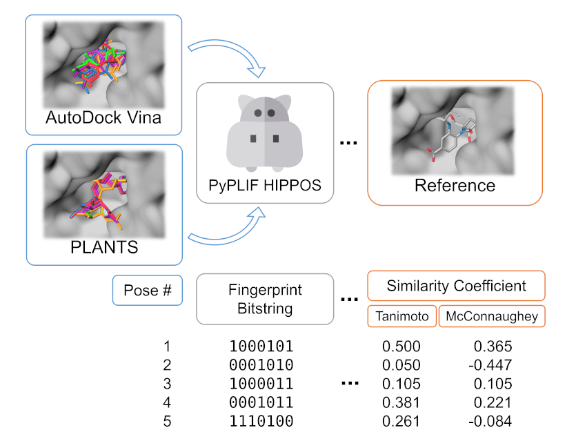
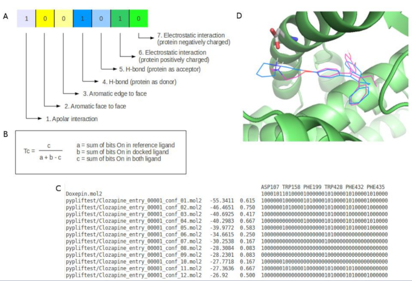

# PyPLIF HIPPOS: A Molecular Interaction Fingerprinting Tool for Docking Results of Autodock Vina and PLANTS

  

Icons made by [Freepik](https://www.freepik.com/) from [Flaticon](http://www.flaticon.com) is licensed by CC 3.0 BY

Welcome to PyPLIF-HIPPOS's project page. PyPLIF-HIPPOS is an upgraded version of [PyPLIF](https://github.com/radifar/pyplif/) (**Python-based Protein-Ligand Interaction Fingerprinting**), a tool for molecular docking post-analysis. It will translate the 3D coordinates of both ligand(s) (generated from docking simulation) and protein into a series of *interaction bitstring* (also known as *Interaction Fingerprint*) (see image below). **HIPPOS** (/ˌhipoʊz/) is a recursive acronym of **HIPPOS Is PyPLIF On Steroids**. From this point forward, PyPLIF-HIPPOS is simplified to HIPPOS.

Compared to PyPLIF, HIPPOS is not only faster and able to generate more customized interaction bitstring, but also supports both [PLANTS](https://uni-tuebingen.de/fakultaeten/mathematisch-naturwissenschaftliche-fakultaet/fachbereiche/pharmazie-und-biochemie/pharmazie/pharmazeutische-chemie/pd-dr-t-exner/research/plants/) & [Vina](http://vina.scripps.edu/)! More over, unlike its predecessor it is (far) more well-documented.

Reprinted with permission from https://doi.org/10.1021/acs.jcim.0c00305. Copyright 2020 American Chemical Society.

Illustration by Radifar et al (2013) from [Bioinformation.net](http://www.bioinformation.net/009/97320630009325.htm) is licensed by [CC 4.0 BY](http://creativecommons.org/licenses/by/4.0)

## Citing HIPPOS

If you are using HIPPOS please cite this paper:

Istyastono, E., Radifar, M., Yuniarti, N., Prasasty, V. and Mungkasi, S., 2020.
PyPLIF HIPPOS: A Molecular Interaction Fingerprinting Tool for Docking Results
of AutoDock Vina and PLANTS. Journal of Chemical Information and Modeling.
https://doi.org/10.1021/acs.jcim.0c00305

-----

&copy; Copyright 2020, Muhammad Radifar & Enade Perdana Istyastono
